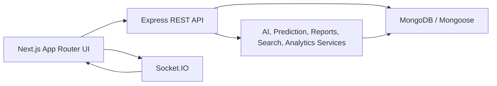

# KAVACH Industrial Decision Intelligence Platform

KAVACH is a production-style Industrial AI Platform for plant monitoring, predictive maintenance, alerting, digital twin operations, work orders, executive analytics, AI copilot workflows, PDF reporting, and role-based operations.

## Architecture



## Folder Structure

- `frontend/app`: App Router pages for dashboard, executive, predictive, copilot, analytics, alerts, digital twin, settings, users, machines, work orders.
- `frontend/components`: reusable layout, dashboard, predictive, copilot, chart, notification, and 3D components.
- `frontend/lib`: typed API clients and client-side analytics helpers.
- `frontend/types`: TypeScript contracts for backend payloads.
- `backend/src/controllers`: REST controllers.
- `backend/src/routes`: Express route modules.
- `backend/src/services`: AI copilot, predictive maintenance, alert engine, reports, analytics, search, notifications, work orders.
- `backend/src/models`: MongoDB models for machines, users, notifications, and work orders.
- `backend/src/middleware`: JWT auth, role checks, security headers, rate limiting, and sanitization.

## API Overview

- `POST /api/auth/login`: login, returns `token`, `refreshToken`, and user.
- `POST /api/auth/refresh`: rotate refresh token and access token.
- `POST /api/auth/logout`: revoke refresh token.
- `POST /api/ai/chat`: AI Maintenance Copilot chat over live machine data.
- `GET /api/ai/report`: AI plant report payload.
- `GET /api/predictive/overview`: plant predictive maintenance overview.
- `GET /api/predictive/:machineId`: machine prediction detail with RUL, history, trend, root cause, confidence.
- `GET /api/executive/dashboard`: OEE, MTBF, MTTR, downtime, energy, carbon, utilization, and department KPIs.
- `POST /api/reports/generate`: generate report JSON or PDF with `format=pdf`.
- `GET /api/reports/:type/pdf`: PDF download for `maintenance`, `plant-health`, `energy`, `weekly`, or `monthly`.
- `GET /api/analytics/overview`: advanced analytics payload.
- `GET /api/analytics/export.csv`: analytics CSV export.
- `GET /api/search?q=...`: global search across machines, predictions, alerts, work orders, engineers, and users.
- `GET/PATCH /api/settings`: profile, password, theme, notifications, and company settings.

## Environment Variables

Backend variables are documented in `backend/.env.example`. Production-oriented examples are in `.env.production.example`.

Required backend values:

- `MONGO_URI`
- `JWT_SECRET`
- `JWT_REFRESH_SECRET`
- `PORT`
- `CORS_ORIGIN`

Frontend values:

- `NEXT_PUBLIC_API_URL`
- `NEXT_PUBLIC_SOCKET_URL`

## Development

```bash
npm run backend:dev
npm run frontend:dev
```

Seed local machine data:

```bash
npm run backend:seed
```

## Validation

```bash
npm run backend:test
npm run frontend:typecheck
npm run frontend:lint
npm run frontend:build
```

## Deployment

Run all services with Docker Compose:

```bash
docker compose up --build
```

Services:

- Frontend: `http://localhost:3000`
- Backend: `http://localhost:5000`
- MongoDB: `mongodb://localhost:27017/kavach`

Before production deployment:

- Replace all JWT secrets.
- Set production `CORS_ORIGIN`.
- Disable sensor simulation unless demo telemetry is intended.
- Point `NEXT_PUBLIC_API_URL` and `NEXT_PUBLIC_SOCKET_URL` at the production backend.
- Configure MongoDB backups and monitoring.

## Phase 8 Implementation Report

Files created:

- Backend: `aiCopilotService.js`, `aiController.js`, `aiRoutes.js`, `executiveAnalyticsService.js`, `executiveController.js`, `executiveRoutes.js`, `reportService.js`, `reportController.js`, `reportRoutes.js`, `searchService.js`, `searchController.js`, `searchRoutes.js`, `analyticsController.js`, `analyticsRoutes.js`, `settingsController.js`, `settingsRoutes.js`, `securityMiddleware.js`.
- Frontend: executive dashboard page, typed executive/search/settings contracts, API helpers for executive/search/reports/settings/auth.
- Deployment/docs: backend Dockerfile, frontend Dockerfile, root Docker Compose, `.dockerignore`, `.env.production.example`, root `README.md`.

Files modified:

- Backend auth, users, machines, notifications, predictions, copilot, work orders, sensor simulation, route registration, schemas, environment examples.
- Frontend layout, sidebar, navbar, copilot, predictive, analytics, alerts, settings, users, API helper, notification/predictive types.

APIs added:

- `/api/ai/chat`
- `/api/ai/report`
- `/api/predictive/:machineId`
- `/api/executive/dashboard`
- `/api/reports/generate`
- `/api/reports/:type/pdf`
- `/api/analytics/overview`
- `/api/analytics/export.csv`
- `/api/search`
- `/api/settings/*`
- `/api/auth/refresh`
- `/api/auth/logout`

Database changes:

- Optional machine `predictionHistory`.
- Optional user notification and theme preferences.
- Enriched notification alert fields: priority, failure probability, suggested action, downtime, recommended engineer, location, timeline, history.
- Added operational indexes for machine, notification, and work-order query paths.

UI changes:

- New executive dashboard at `/dashboard/executive`.
- Global search in the navbar.
- PDF report downloads.
- Real settings page.
- Role-filtered sidebar.
- Enriched alert center.
- Analytics CSV export.
- Copilot now uses `/api/ai/chat`.

Migration steps:

1. Deploy backend with the new models.
2. Restart the backend so Mongoose creates new indexes.
3. Ensure all existing users have supported roles. `Super Admin` and `Admin` are treated as equivalent.
4. Set `JWT_REFRESH_SECRET` before using refresh tokens in production.
5. Existing machine, notification, and user documents remain valid because new fields are optional.

Testing checklist:

- Backend unit tests pass.
- Frontend typecheck passes.
- Frontend lint passes.
- Frontend production build passes.
- Login still returns `token` and now also returns `refreshToken`.
- Dashboard pages load with authenticated API requests.
- Report PDF endpoints return `application/pdf`.
