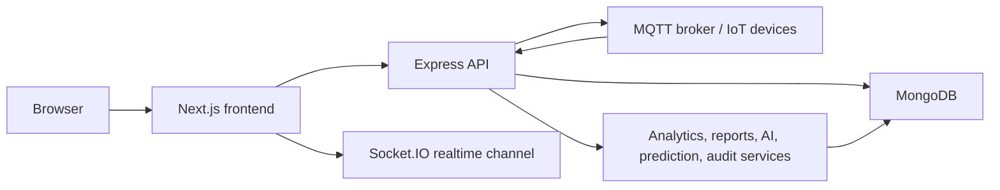

# KAVACH Industrial Decision Intelligence Platform

KAVACH is a production-ready industrial operations platform for plant monitoring, predictive maintenance, digital twin views, work orders, alerts, reports, analytics, AI-assisted maintenance workflows, audit logs, tenant administration, and role-based access control.

## Architecture



## Folder Structure

- `frontend/app`: Next.js App Router pages and route-level screens.
- `frontend/components`: layout, dashboard, chart, predictive, copilot, notification, enterprise, and 3D UI components.
- `frontend/lib`: typed API clients, auth helpers, socket helpers, and frontend service wrappers.
- `frontend/types`: TypeScript contracts for backend responses.
- `backend/src/controllers`: HTTP controller logic.
- `backend/src/routes`: Express route modules mounted under `/api`.
- `backend/src/services`: analytics, AI, reporting, search, prediction, notification, backup, and work-order services.
- `backend/src/models`: Mongoose models.
- `backend/src/middleware`: auth, permissions, tenant context, security, rate limiting, observability, validation, and errors.
- `backend/src/iot`: MQTT clients, device registry, telemetry ingestion, and device health.
- `deployment`: supporting deployment configuration such as Mosquitto config.
- `nginx`: reverse proxy config for Docker Compose deployments.

## Requirements

- Node.js 22
- npm
- MongoDB 7 or a managed MongoDB connection string
- MQTT broker if IoT ingestion is enabled

## Setup

1. Install dependencies.

```bash
npm --prefix backend ci
npm --prefix frontend ci
```

2. Create local env files from examples.

```bash
copy backend\.env.example backend\.env
copy frontend\.env.example frontend\.env
```

3. Fill in local values. Do not commit `.env` files.

4. Start the apps.

```bash
npm run backend:dev
npm run frontend:dev
```

Default local URLs:

- Frontend: `https://kavach-1-7749.onrender.com`
- Backend: `https://kavach-spgh.onrender.com`
- API docs: `https://kavach-spgh.onrender.com/api/docs`
- Public health: `https://kavach-spgh.onrender.com/api/health`

## Environment Variables

Safe examples are provided in:

- `.env.example`: combined production reference.
- `backend/.env.example`: backend service variables.
- `frontend/.env.example`: frontend service variables.

Required backend production variables:

- `NODE_ENV=production`
- `PORT`
- `MONGO_URI`
- `JWT_SECRET`
- `JWT_REFRESH_SECRET`
- `CORS_ORIGIN`

Required frontend production variables:

- `NEXT_PUBLIC_API_URL`
- `NEXT_PUBLIC_SOCKET_URL`

Important optional backend variables:

- `API_VERSION`
- `JWT_EXPIRES_IN`
- `JWT_REFRESH_EXPIRES_IN`
- `RATE_LIMIT_WINDOW_MS`
- `RATE_LIMIT_MAX`
- `AUTH_RATE_LIMIT_MAX`
- `BRUTE_FORCE_WINDOW_MS`
- `BRUTE_FORCE_MAX_FAILURES`
- `IOT_ENABLED`
- `ENABLE_SENSOR_SIMULATION`
- `MQTT_BROKER_URL`
- `MQTT_USERNAME`
- `MQTT_PASSWORD`
- `MQTT_CLIENT_ID`
- `MQTT_KEEPALIVE`
- `MQTT_RECONNECT_MS`
- `DEVICE_SECRET`
- `DEVICE_OFFLINE_AFTER_MS`
- `DEVICE_HEARTBEAT_MONITOR_MS`
- `PUBLIC_API_BASE_URL`
- `OPENAI_API_KEY`
- `AI_PROVIDER`
- `OPENAI_MODEL`
- `ENERGY_COST_PER_KWH`
- `CARBON_KG_PER_KWH`
- `DOWNTIME_COST_PER_HOUR`
- `COMPANY_NAME`
- `COMPANY_SITE`
- `COMPANY_INDUSTRY`
- `COMPANY_TIMEZONE`
- `BACKUP_DIR`
- `BACKUP_RETENTION_DAYS`
- `BACKUP_SCHEDULE_ENABLED`
- `BACKUP_SCHEDULE_INTERVAL_MS`
- `BACKUP_RESTORE_TOKEN`
- `AUDIT_RETENTION_DAYS`
- `COMPRESSION_THRESHOLD_BYTES`

## API Endpoints

API base path: `/api`

- Auth: `POST /auth/login`, `POST /auth/register`, `POST /auth/refresh`, `POST /auth/logout`
- Machines: `GET /machines`, `POST /machines`, `GET /machines/:id`, `PATCH /machines/:id`, `DELETE /machines/:id`
- IoT: `/iot/*` for device registration, telemetry, status, and MQTT operations
- Predictive: `GET /predictive/overview`, `GET /predictive/:machineId`
- Work orders: `GET /workorders`, `POST /workorders`, status/assign/complete/export endpoints
- Notifications: `GET /notifications`, `POST /notifications`, archive, preferences, and rules endpoints
- Reports: report generation and export endpoints under `/reports`
- Analytics: analytics overview and export endpoints under `/analytics`
- Executive: executive dashboard endpoints under `/executive`
- Enterprise: enterprise operations endpoints under `/enterprise`
- Tenants: tenant hierarchy endpoints under `/tenants`
- Users: RBAC user management under `/users`
- Settings: profile, password, preferences, and company settings under `/settings`
- Audit: audit list and export endpoints under `/audit`
- Search: `GET /search?q=...`
- Billing: subscription and invoice endpoints under `/billing`
- Backup: export, configuration, and restore endpoints under `/backup`
- System: `GET /system/health`
- Docs: `GET /docs`, `GET /docs/openapi.json`
- Public health: `GET /health`

The OpenAPI document is available at `/api/docs/openapi.json`.

## Validation

Run before every release:

```bash
npm run frontend:typecheck
npm run frontend:lint
npm run frontend:build
npm run backend:test
```

## Deployment

### Frontend on Vercel

Use `frontend` as the Vercel project root.

- Build command: `npm run build`
- Install command: `npm ci`
- Output: Next.js default
- Required env:
  - `NEXT_PUBLIC_API_URL=https://<backend-service-url>`
  - `NEXT_PUBLIC_SOCKET_URL=https://<backend-service-url>`

`frontend/vercel.json` is included for framework/build settings.

### Backend on Render

Use `render.yaml` or create a Render Web Service manually.

- Root directory: `backend`
- Build command: `npm ci --omit=dev`
- Start command: `npm run start`
- Health check path: `/api/health`
- Required env:
  - `NODE_ENV=production`
  - `MONGO_URI`
  - `JWT_SECRET`
  - `JWT_REFRESH_SECRET`
  - `CORS_ORIGIN=https://<frontend-domain>`

### Backend on Railway

Use `backend` as the Railway service root.

- Build command: `npm ci --omit=dev`
- Start command: `npm run start`
- Required env values match the backend production list above.

`backend/railway.json` is included for build/start settings.

### Docker Compose

For single-host deployments:

```bash
docker compose up --build -d
```

Review `docker-compose.yml`, `nginx/kavach.conf`, and `deployment/mosquitto.conf` before exposing public traffic.

## Release Checklist

See `RELEASE_CHECKLIST.md`.
